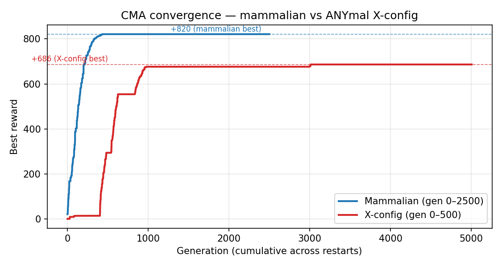
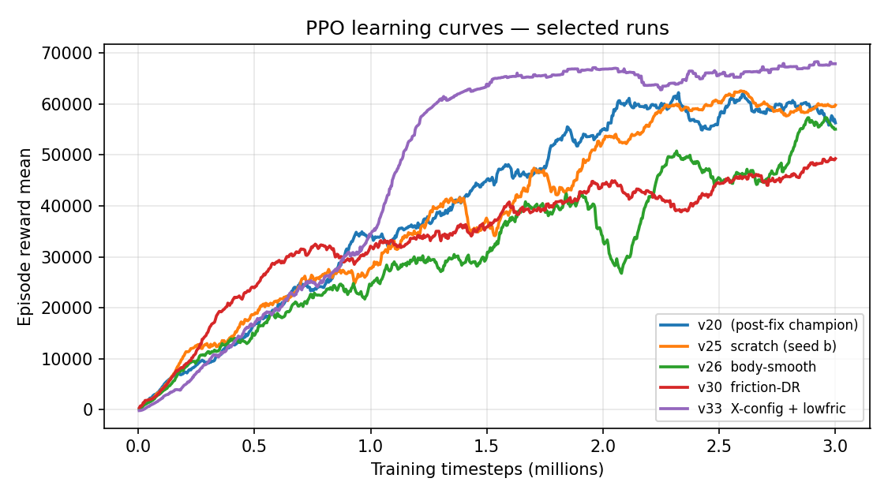

# Optimus Primal — MuJoCo Gait Simulation

## Results at a Glance

**CMA convergence — mammalian vs ANYmal X-config:**



X-config reaches ~84 % of the mammalian gen-2500 winner in 1/5 the compute. Both deploy to hardware (slow phase times settle the PD).

**PPO learning curves — selected runs across the v20 → v33 journey:**



v30/v33 hit ~60–70 k ep_rew_mean *because* they exploited MuJoCo's underdamped PD as a low-pass filter — none of the high-reward runs deploy to hardware. See `METHODS.md §4.15` for the actuator-gap finding and §4.16 for the velocity-slew fix that's expected to close the gap.

## Local Development

### Prerequisites
- Python 3.10+
- `pip install "mujoco>=3.2" cma scipy numpy matplotlib`

### Quick Start

```bash
# Demo the hand-tuned gait in the viewer
mjpython mujoco_gait.py --demo

# Replay a trained CMA gait (mammalian)
mjpython mujoco_gait.py --replay best_gait.json

# Replay an X-config (ANYmal) CMA gait
mjpython mujoco_gait.py --replay cma_xconfig.json --xconfig

# Train locally with CMA-ES (default)
python3 mujoco_gait.py --tune --generations 150

# Train with different algorithm or seed
python3 mujoco_gait.py --tune --algo de --init random --generations 200
```

### Replaying Trajectories

**CMA gaits** (JSON of joint angles):
```bash
mjpython mujoco_gait.py --replay <path-to-gait.json>          # mammalian
mjpython mujoco_gait.py --replay <path-to-gait.json> --xconfig # ANYmal X
mjpython mujoco_gait.py --replay <path> --cycles 10            # more cycles
```

**PPO policies** (zip + vecnormalize.pkl):
```bash
# Always pass the same env flags the policy was trained with —
# friction range, xconfig, slew-rate, kp/kv. They live in train_ppo.py
# config or the run's tb-name suggests them.
mjpython train_ppo.py --replay models/ablations/ppo_v35_slew_a.zip \
    --xconfig --slew-rate 125 --friction-range 0.2,0.5 \
    --deterministic                                        # mean action
```

**Static pose check** for the X-config URDF (no gait, just confirm the
robot stands in the configured stance):
```bash
mjpython view_xconfig.py
mjpython view_xconfig.py --z=0.10            # closer to floor
mjpython view_xconfig.py --hip-mult=1.3      # wider stance
mjpython view_xconfig.py --mammal            # plain URDF for comparison
```

### X-Config + PPO Training

The ANYmal X-stance URDF (`optimus_primal_xconfig.urdf`) has the rear hip and rear knee axes flipped. Training:
```bash
# CMA xconfig
python3 mujoco_gait.py --tune --xconfig --generations 500

# PPO with the velocity-slew actuator (deployable target)
python3 train_ppo.py --timesteps 3000000 --n-envs 3 \
    --xconfig --slew-rate 125 \
    --friction-range 0.2,0.5 --fall-tilt 30 \
    --out models/ppo_v35_slew_a.zip --tb-name v35_slew_a_1
```
The `--slew-rate 125` flag rate-limits `data.ctrl` to 125°/s (matching measured LX-16A response under load) so the PPO action stream emerges as a deployable trajectory rather than a bang-bang exploit of MuJoCo's underdamped PD. See `METHODS.md §4.15-4.16` for the full story.

### Diagnostics

```bash
# Check whether a PPO policy is deployable (saturation rate, qpos-replay)
python3 ppo_actuator_gap.py --policy models/ablations/ppo_v35_slew_a.zip \
    --friction 0.3

# Per-friction sweep on a friction-DR policy
python3 ppo_stats.py --policy models/ablations/ppo_v30_bodysmooth_dr.zip \
    --friction 0.3 --episodes 30
```

### Training Options

| Flag | Values | Default | Description |
|------|--------|---------|-------------|
| `--algo` | `cma`, `random`, `de` | `cma` | Optimization algorithm |
| `--init` | `gait`, `stand`, `random` | `gait` | Initial seed |
| `--generations` | int | 150 | Number of generations |
| `--popsize` | int | 48 | Population size per generation |
| `--workers` | int | cpu_count - 1 | Parallel rollout workers |
| `--cycles` | int | 5 | Gait cycles per evaluation |
| `--resume` | flag | - | Resume from existing best JSON |

### Other Tools

```bash
# 3-leg balance tuning
mjpython mujoco_balance.py --tune --lift FL
mjpython mujoco_balance.py --replay best_balance_FL.json

# Center of mass calculator (for body layout)
python3 com_calculator.py
```

## Cluster (Slurm)

### First-Time Setup

```bash
bash slurm_setup.sh
```

This creates a venv at `/cluster/home/$USER/robotics/LBS-1a/venv` and installs
`mujoco>=3.2`, `cma`, `scipy`, `numpy`, `matplotlib`.

### Launch Training Jobs

```bash
# Submit all 9 combos (3 algos x 3 seeds) at one or more epoch counts
bash launch_all.sh 50 200 1000 2500
```

Each invocation creates a timestamped run:
- Results: `results/<timestamp>/<algo>_<init>/<gens>/`
- Logs:    `logs/<timestamp>/`
- Manifest: `results/<timestamp>/manifest.txt`

Each job runs from a temp working directory so parallel jobs don't clobber
each other's intermediate files.

### Monitor

```bash
squeue -u $USER
tail -f logs/<timestamp>/gait_cma_gait_200_*.out
```

### Collect Results

```bash
# Summary table of rewards for latest run
bash collect_results.sh

# Specific run or all runs
bash collect_results.sh 20260422_005700
bash collect_results.sh all

# Find best reward in a directory (one-liner)
python3 -c "import json,glob;files=glob.glob('results/<timestamp>/**/best_gait*.json',recursive=True);s=sorted((json.load(open(f))['reward'],f) for f in files);[print(f'  {r:+8.2f}  {f}') for r,f in s];print(f'Best: {s[-1][0]:+.2f}  {s[-1][1]}')"
```

## Analysis & Visualization

These run locally after pulling results back from the cluster.

### Convergence plots (reward vs generation)

```bash
python3 plot_results.py
```

Outputs:
- `convergence_all.png` — all runs on one chart
- `convergence_seed_<init>.png` — per seed, comparing algorithms
- `convergence_algo_<algo>.png` — per algorithm, comparing seeds

### Rank gaits by walking distance

Reward is what the optimizer scored; distance walked is what you actually
care about. `rank_gaits.py` runs a fresh rollout for every `best_gait*.json`
and prints them sorted.

```bash
# Rank everything under results/ by distance (default)
python3 rank_gaits.py

# Rank one specific run
python3 rank_gaits.py results/20260422_005700

# Top 5 by speed (m/s) instead of total distance
python3 rank_gaits.py --sort speed --top 5

# Sort by the training reward stored in each JSON
python3 rank_gaits.py --sort reward

# Longer rollouts (default is 10 cycles)
python3 rank_gaits.py --cycles 15
```

### Per-gait rollout plots

```bash
# Full telemetry for one gait (trajectory, orientation, joints, distance)
python3 record_rollout.py results/20260422_005700/cma_gait/1000/best_gait.json

# Overlay distance + pitch for multiple gaits
python3 record_rollout.py --compare \
    results/.../cma_gait/1000/best_gait.json \
    results/.../cma_gait/2500/best_gait.json \
    results/.../random_gait/2500/best_gait_rand.json
```

Outputs per gait: `rollout_<name>_trajectory.png`, `_orientation.png`,
`_joints.png`, `_distance.png`. Compare mode saves `rollout_comparison.png`.

### Static gait visualization

```bash
# Heatmap + per-leg trajectory of the angles in a best_gait JSON
python3 plot_gaits.py results/20260422_005700/cma_gait/1000/best_gait.json

# Side-by-side heatmap comparison
python3 plot_gaits.py --compare \
    results/.../cma_gait/1000/best_gait.json \
    results/.../cma_gait/2500/best_gait.json
```

## Loading a Gait onto the Robot

```bash
# Copy the best gait JSON to the robot
scp best_gait.json admin@169.254.1.2:LBS-1a/robot/

# On the robot — cautious first run (2x slower)
cd ~/LBS-1a/robot
python gait_controller.py --gait best_gait.json --n=3 --slow

# Full speed with distance measurement
python gait_controller.py --gait best_gait.json --n=10
```

## File Overview

| File | Purpose |
|------|---------|
| `sim_core.py` | Shared MuJoCo plumbing (build_model, joint lookups, body-attitude helpers) — used by both CMA and RL |
| `reward.py` | `RewardAccumulator`: per-step attitude tracking, fall detection, final reward + info |
| `mujoco_gait.py` | CMA-ES / DE / random-search training (phase-based gait structure) |
| `gym_env.py` | Gymnasium env for RL training (closed-loop policy, no phase structure) |
| `mujoco_balance.py` | 3-leg balance tuning |
| `optimus_primal.urdf` | Robot model |
| `com_calculator.py` | Center of mass layout tool |
| `launch_all.sh` | Submit all training jobs to slurm |
| `train_job.sbatch` | Single slurm job template |
| `slurm_setup.sh` | One-time cluster venv setup |
| `collect_results.sh` | Summarize training rewards |
| `plot_results.py` | Convergence plots from tune_gait*.jsonl logs |
| `rank_gaits.py` | Rank trained gaits by rollout distance/speed |
| `record_rollout.py` | Per-step telemetry + plots for one or more gaits |
| `plot_gaits.py` | Static heatmap/trajectory plots of a gait JSON |
| `slides.tex` | Beamer presentation |
| `slides.md` | Slide content (markdown version) |
